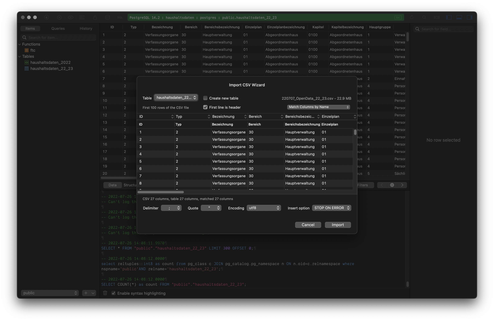

<!-- ALL-CONTRIBUTORS-BADGE:START - Do not remove or modify this section -->

[](#contributors-)

<!-- ALL-CONTRIBUTORS-BADGE:END -->

# Haushaltsdaten Supabase Backend

Small supabase setup for [haushaltsdaten visualization project](https://haushaltsdaten.odis-berlin.de/) by [ODIS](https://odis-berlin.de/). See the frontend repo [here](https://github.com/berlin/haushaltsdaten)

## Prerequisites

- [Docker](https://docker.com)
- [Supabase](https://supabase.com) Account
- A Supabase project to work with
- The [Supabase CLI](https://github.com/supabase/cli)
- "Haushaltsdaten" data from https://daten.berlin.de/datensaetze/ exported as CSV (2022/23 is provided in this repo)
  - Use Excel File > Save As > CSV
- [Deno](https://deno.land/) for debugging edge functions only

If you don't feel comfortable with having your data stored on supabase.com (which uses AWS) you can run your own supabase setup. See the [guides on self hosting](https://supabase.com/docs/guides/hosting/overview) and the [docker examples](https://github.com/supabase/supabase/tree/master/docker) in their public repo.

## Installation

_(The following steps assume you are using the hosted version of supabase)_ To install this project, run the following command:

```bash
git clone git@github.com:berlin/haushaltsdaten-supabase.git
cd haushaltsdaten-supabase
supabase start
supabase link --project-ref <YOUR PROJECT REF>
supabase db remote set <YOUR DB URL>
supabase db push
```

You will need use some kind of tool like TablePlus, Postico or PGAdmin to populate the db with data from. If you are not familiar with Postgres Databases use TablePlus. It has the easiest interface.

For your local database instance you can use the following credentials:

- User: `postgres`
- Password: `postgres`
- Database: `postgres`

On the remote database the password was set by you when you created the project.

You will have to import the data only in the remote DB. If you want to try things out first or you want to make changes to the schema use the local instance.

---

**Hint!:** **When importing the data into the table `haushaltsdaten_22_23` Make sure to use `;` as delimiter.**



---

When your data is imported you need to refresh the materialized view. Run this query in your database tool.

```sql
REFRESH MATERIALIZED VIEW haushaltsdaten_current;
```

## Update the Data

Once a new "Haushaltsplan" is published you will have to:

- Import the data into a new table locally
- Update the materialized view query for the table `haushaltsdaten_current` to point at that new data
- Refresh the materialized view

We recommend to do this locally and afterwards push these changes to the remote database. Within this repo you will find an [workflow](./.github/workflows/deploy-to-supabase.yml) that updates the production database using GitHub Actions.

```bash
supabase start
# make your adjustments
git switch -c your-update-data-branch
db diff --file <your migration name> --schema public --use-migra
git add .
git commit -m "your commit message"
git push origin your-update-data-branch
```

Create your pull request against the `main` branch. Once merged the workflow will run and update the production database.

Then populate the new table on the remote with the new data and refresh your materialized view.

```sql
REFRESH MATERIALIZED VIEW haushaltsdaten_current;
```

## Usage Functions

The functions are currently not used in production. They where meant to be used as endpoint to obtain the data for the treemap view pre configured. We de this currently in the frontend.

```bash
# Make a request to get the all the `Einnahmetitel` data:
curl -L -X POST 'https://zrbypchhbikbfvgqptbk.functions.supabase.co/treemap-data' -H 'Authorization: Bearer <YOUR ANON KEY HERE>'
# Make a request to get the all the `Ausgabetitel` data:
curl -L -X POST 'https://zrbypchhbikbfvgqptbk.functions.supabase.co/treemap-data?type=Ausgabetitel' -H 'Authorization: Bearer <YOUR ANON KEY HERE>'
# Make a request to get the all the `Einnahmetitel` data for the area Mitte
# The areas can be filtered with the following queries
#
# key: "hauptverwaltung" gives you: "Hauptverwaltung",
# key: "pankow" gives you: "Pankow",
# key: "reinickendorf" gives you: "Reinickendorf",
# key: "steglitz_zehlendorf" gives you: "Steglitz-Zehlendorf",
# key: "friedrichshain_kreuzberg" gives you: "Friedrichshain-Kreuzberg",
# key: "marzahn_hellersdorf" gives you: "Marzahn-Hellersdorf",
# key: "neukoelln" gives you: "Neukölln",
# key: "lichtenberg" gives you: "Lichtenberg",
# key: "treptow_koepenick" gives you: "Treptow-Köpenick",
# key: "tempelhof_schoeneberg" gives you: "Tempelhof-Schöneberg",
# key: "spandau" gives you: "Spandau",
# key: "mitte" gives you: "Mitte",
# key: "charlottenburg_wilmersdorf" gives you: "Charlottenburg-Wilmersdorf",
#
curl -L -X POST 'https://zrbypchhbikbfvgqptbk.functions.supabase.co/treemap-data?bezirk=mitte' -H 'Authorization: Bearer <YOUR ANON KEY HERE>'
```

## Contributing

Please see the issues in the repo https://github.com/berlin/haushaltsdaten/issues if you like to contribute or open a new one.

### Contributors ✨

Thanks goes to these wonderful people ([emoji key](https://allcontributors.org/docs/en/emoji-key)):

<!-- ALL-CONTRIBUTORS-LIST:START - Do not remove or modify this section -->
<!-- prettier-ignore-start -->
<!-- markdownlint-disable -->
<table>
  <tr>
    <td align="center"><a href="https://fabianmoronzirfas.me/"><br /><sub><b>Fabian Morón Zirfas</b></sub></a><br /><a href="https://github.com/berlin/haushaltsdaten-supabase/commits?author=ff6347" title="Documentation">📖</a> <a href="https://github.com/berlin/haushaltsdaten-supabase/commits?author=ff6347" title="Code">💻</a> <a href="#design-ff6347" title="Design">🎨</a> <a href="#infra-ff6347" title="Infrastructure (Hosting, Build-Tools, etc)">🚇</a></td>
  </tr>
</table>

<!-- markdownlint-restore -->
<!-- prettier-ignore-end -->

<!-- ALL-CONTRIBUTORS-LIST:END -->

This project follows the [all-contributors](https://github.com/all-contributors/all-contributors) specification. Contributions of any kind welcome!

## Content Licensing

Files in folder [`./data`](/data) and the file [`./supabase/seed.sql`](./supabase/seed.sql) are available as [CC BY](https://creativecommons.org/licenses/by/3.0/de/) from [daten.berlin.de](https://daten.berlin.de/datensaetze)

## Credits

<table>
  <tr>
    <td>
      Made by <a src="https://citylab-berlin.org/de/start/">
        <br />
        <br />
        
      </a>
    </td>
    <td>
      A project by <a src="https://www.technologiestiftung-berlin.de/">
        <br />
        <br />
        
      </a>
    </td>
    <td>
      Supported by <a src="https://www.berlin.de/rbmskzl/">
        <br />
        <br />
        
      </a>
    </td>
  </tr>
</table>

## Related Projects
